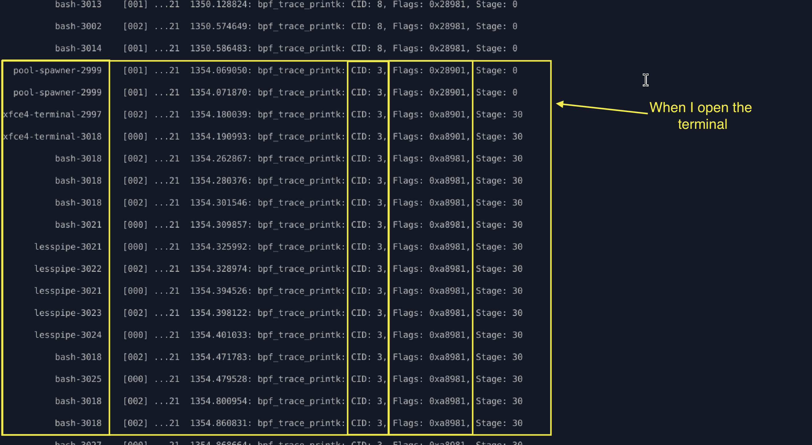
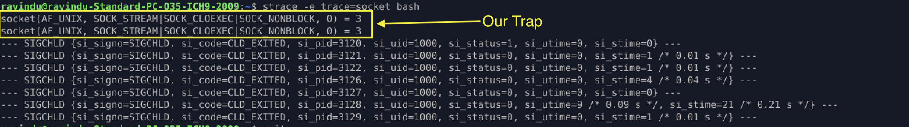
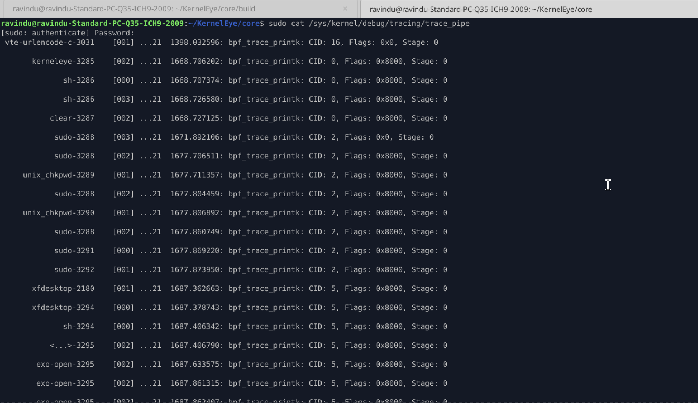
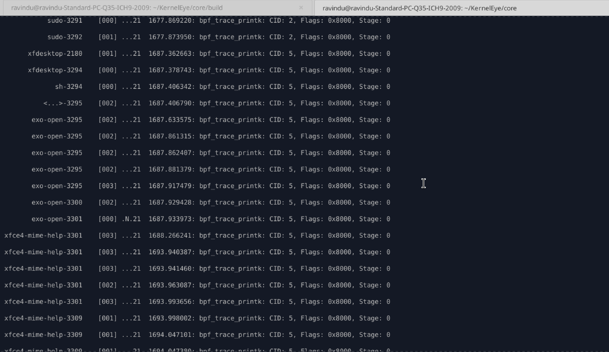
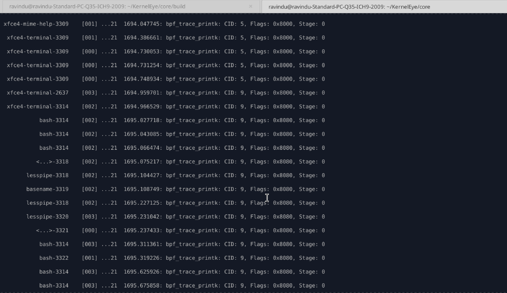

# Terminal vs. Reverse Shell: The Noise War Inside the Linux Kernel

While building KernelEye, I ran into something that seriously made me question my own logic.

I spent hours working on a reverse shell detection engine… only to realize I had accidentally turned my own terminal into a *threat*.

Yeah — my terminal was getting flagged as `HIGH_RISK`.

At first, I thought I messed up something badly. But later, I realized this was one of the most important lessons I’ve learned about behavioral monitoring.

If you're building with eBPF, you're going to hit this wall too.

I call it: **the Noise Wall.**

---

## 1. The Problem

Everything looked fine — until I opened a new terminal or ran a `sudo` command.

Suddenly, my system started flagging normal activity as suspicious.

### 1.1 What I saw



My first reaction was simple:

> *"What the hell is this?"*

Because detecting malicious behavior is actually easier than dealing with system noise.

So I started breaking it down.

---

## 2. Analyzing the Flags

I noticed a few recurring flag patterns:

* `0x28901`
* `0xa8901`
* `0xa8981`

### 2.1 Breaking them down

#### 1. pool-spawner → `0x28901`

* binary: `101000100100000001`
* flags:

  * `SOCKET_SEEN`
  * `DUP2_SEEN`
  * `FD_REDIRECTS_SEEN`
  * `FORK_SEEN`
  * `OPENAT_SEEN`

At first glance, this *looks* suspicious.

But then I paused:

> Why is a legit process using a socket?

Everything else made sense — but the socket didn’t.

---

#### 2. xface-terminal → `0xa8901`

* binary: `10101000100100000001`
* flags:

  * `SOCKET_SEEN`
  * `DUP2_SEEN`
  * `FD_REDIRECTS_SEEN`
  * `FORK_SEEN`
  * `OPENAT_SEEN`
  * `PTMX_SEEN`

Now it gets more interesting.

This is clearly a normal terminal process… but behavior-wise, it looks very similar to a reverse shell.

Again, same question:

> Why does this need a socket?

---

#### 3. bash / lesspipe → `0xa8981`

* binary: `10101000100110000001`
* flags:

  * `SOCKET_SEEN`
  * `DUP_SEEN`
  * `DUP2_SEEN`
  * `FD_REDIRECTS_SEEN`
  * `FORK_SEEN`
  * `OPENAT_SEEN`
  * `PTMX_SEEN`

These are completely legitimate processes.

But my system was flagging them just because of **socket creation**, assuming it meant network activity.

That assumption was wrong.

---

## 3. The Trap

At this point, I decided to trace `bash` to understand what's really happening.



That’s when I found the real issue.

My bitmask logic was too broad.

I wasn’t distinguishing between:

* `AF_UNIX` → local IPC
* `AF_INET` / `AF_INET6` → actual network communication

So even local socket usage inside the terminal was getting flagged as suspicious.

To confirm, I used `strace`.

And yep — Bash was just making **local socket calls**, nothing malicious.

---

## 4. The Fix

Once I understood the gap, the fix was simple but important:

Only set the socket-related flags if the family is:

* `AF_INET`
* `AF_INET6`

---

### 4.1 Implementation

This logic is handled inside my `socket_create` LSM hook:

`core/probes/socket_create.bpf.c`

link: <a href="https://github.com/Ravindu-Priyankara/KernelEye/blob/ba1048bebfe63dc874eb0ef10321743e4e6203b7/core/probes/socket_create_lsm.bpf.h">Original Code reference</a>


code:

```c
SEC("lsm/socket_create")
int BPF_PROG(trace_socket_create, int family, int type, int protocol, int kern){

    if(kern) return 0;

    if(family != AF_INET && family != AF_INET6) return 0;
    ...

    return 0;
}
```

This small check made a huge difference.

After that change, the noise dropped almost to zero.

---

### 4.2 Evidence

#### sudo command behavior



#### General terminal activity



#### Opening a new terminal



---

## Final Thought

This experience changed how I think about detection systems.

It’s not just about catching malicious behavior.

It’s about **not flagging normal behavior as malicious**.

Because in real systems, noise is the real enemy.

---

If you're building anything in eBPF or kernel-level monitoring:

You won’t fail because detection is hard.

You’ll fail because **everything looks like an attack at first**.

And learning to separate signal from noise…

That’s the real skill.
