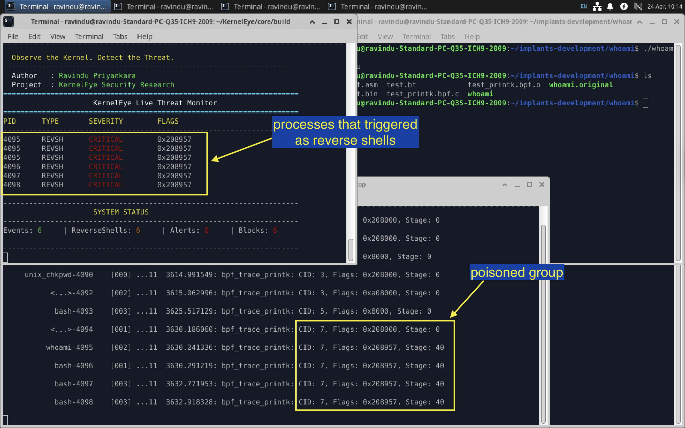
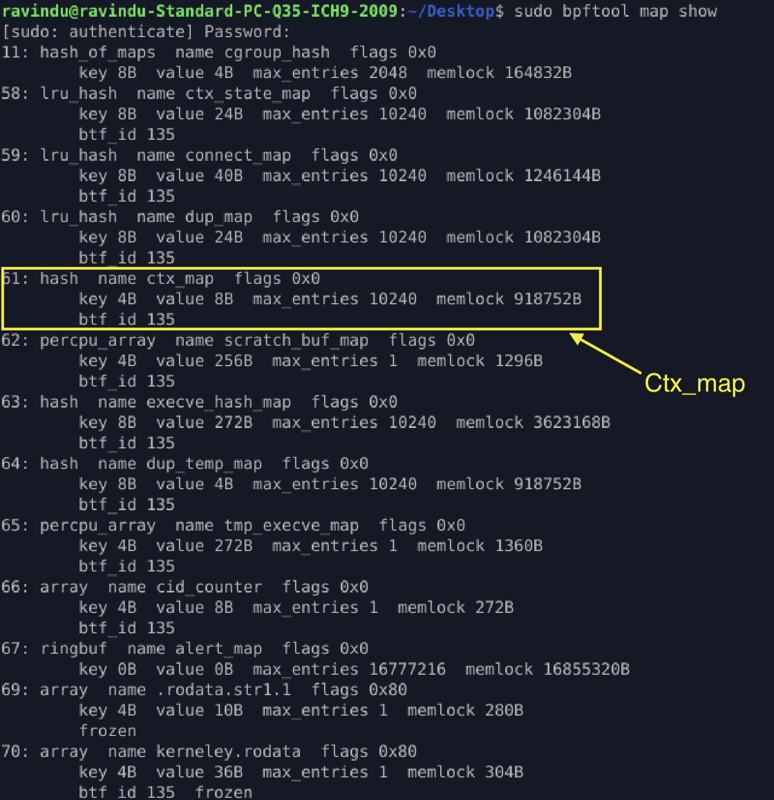
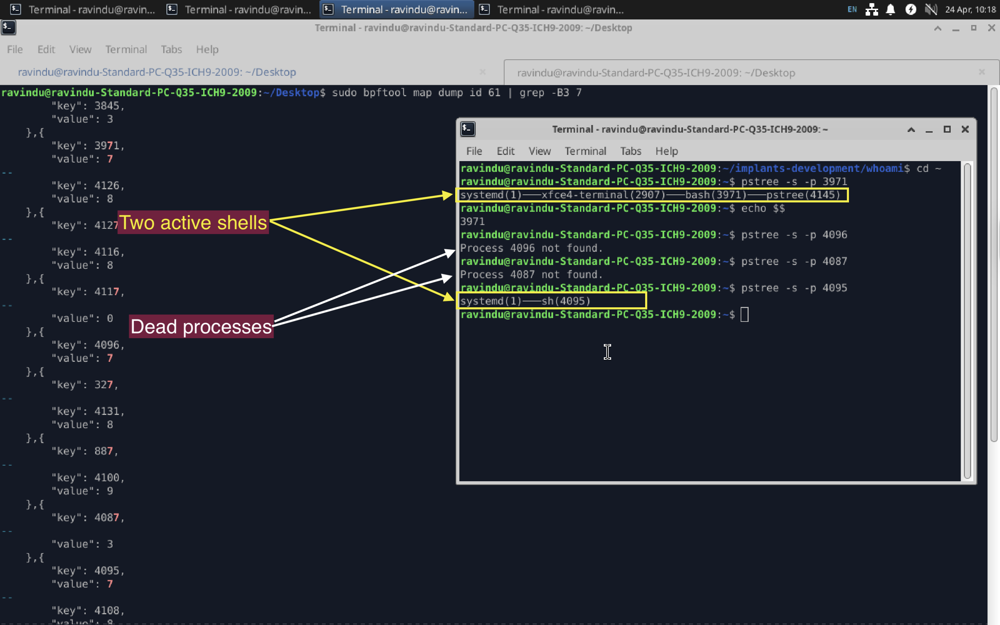
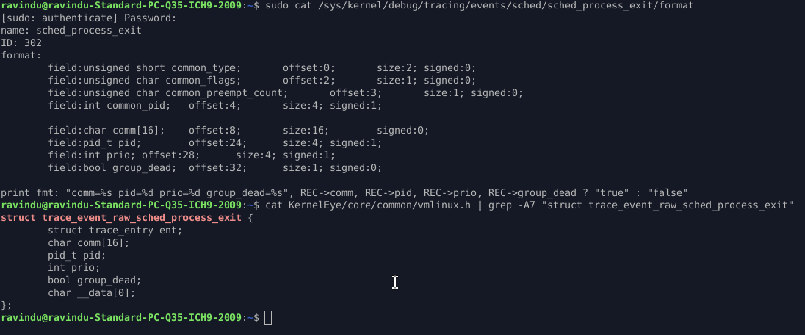
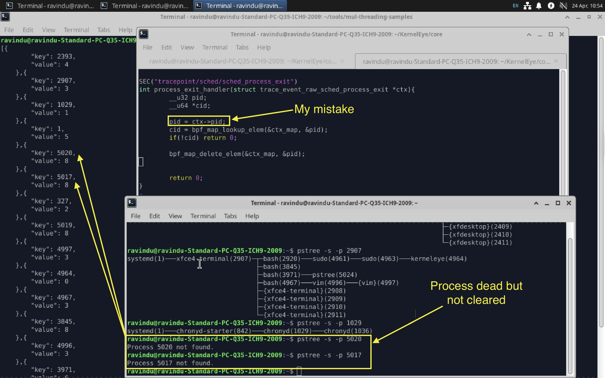
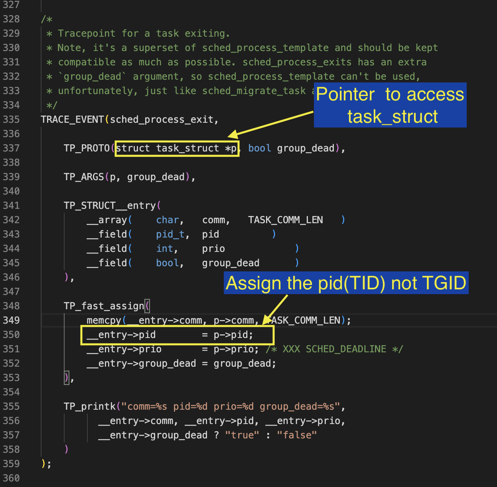
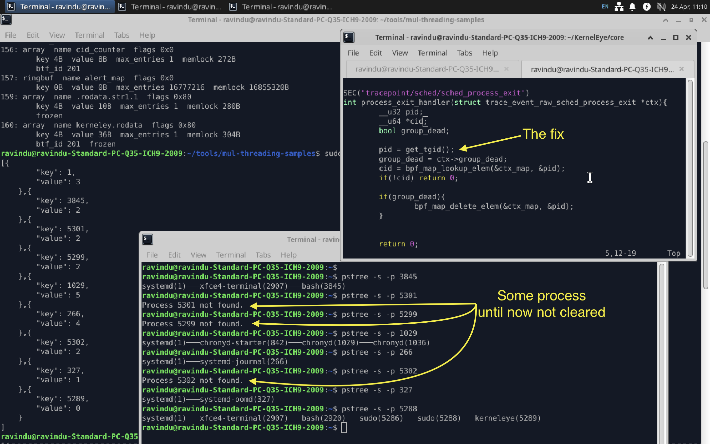
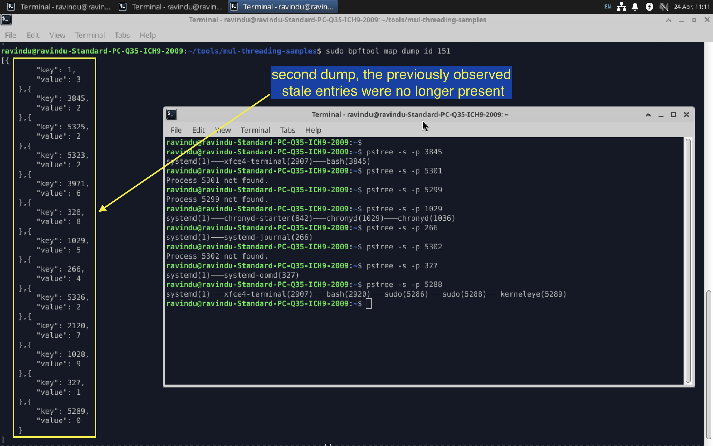
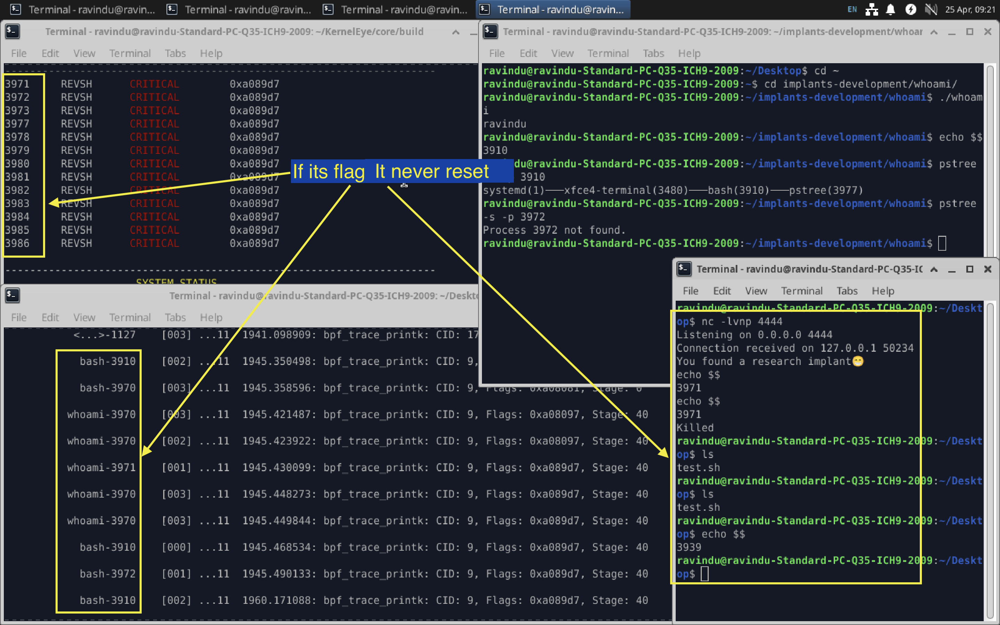
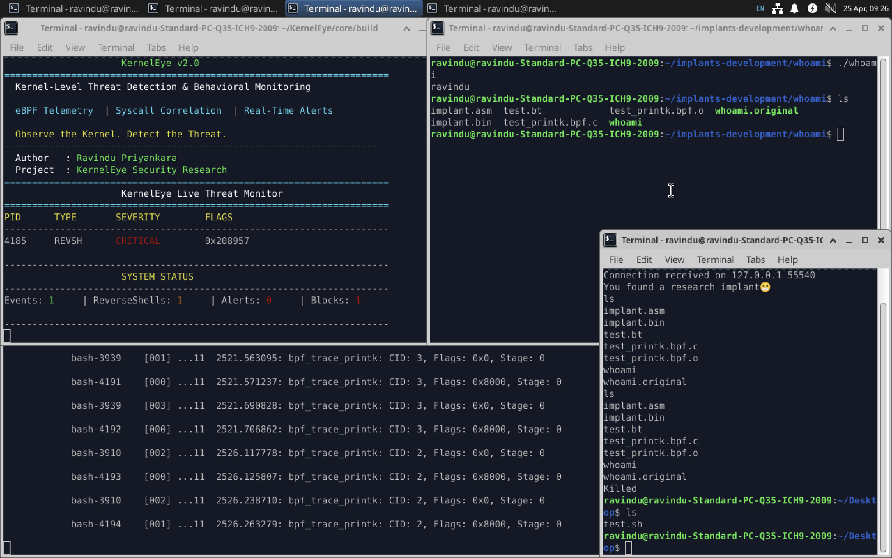

# When Process Death Doesn’t Reset Risk: Context Persistence Bug in eBPF Detection

During kernelEye detection rule adjustments, I encountered an interesting bug worth sharing.
The issue can be reproduced and understood within a few minutes through the write-up or the debugging video, but the actual root cause and fix took nearly two days of investigation and iteration.

## 1.The Problem

Normally, the system behaves as follows
1. Detect a reverse shell
2. Terminate it immediately through the enforcement layer
3. Send the event data to user space for analysis and display

However, the issue appeared after this flow.

After killing an initial reverse shell process (and its associated terminal session), the system began behaving incorrectly on subsequent terminal launches.

When attempting to open a new terminal session, it would immediately trigger enforcement again, escalating to the point where it effectively terminated the entire terminal group—including the newly created session itself.

In short, after the first reverse shell was killed, the detection context incorrectly persisted, causing normal terminal processes to be treated as suspicious activity and triggering cascading enforcement actions.

## **2. Analysis**

### **Step 1 — Isolating the Detection Layer**

Analyzing this issue with the enforcement layer active was not practical, as processes were being terminated immediately.
To properly observe the behavior, the first step was to temporarily disable enforcement.

In this project, enforcement is implemented using LSM hooks such as:

* `bprm_check_security`
* `task_alloc`
* `socket_connect`

For debugging purposes, I disabled enforcement by commenting out the termination logic:

```c
bpf_send_signal(SIGKILL);
return -EPERM;
```

This allowed the system to continue running while still collecting detection signals, making it possible to observe how flags and context behaved without interference from forced process termination.


### **Step 2 — Instrumenting Debug Output**

To observe how flags and stages evolve at runtime, I added targeted debug instrumentation.

In this project, I typically use two debugging approaches:

* **Map-based counters** for tracking state issues or missing data paths
* **`bpf_printk` output** for inspecting runtime values via `trace_pipe`

For this issue, I needed visibility into **flags and stage transitions**, so I used the `bpf_printk`-based approach.

To ensure consistent visibility across executions, I attached the debug call to the `bprm_check_security` LSM hook, since it is triggered on every executable invocation.

The following debug function was used:

```c id="v1yq7m"
print_flags_and_score(cid, ke_state->flags, ke_state->stage);
```

This helper (defined in `helpers/testing_helpers.h`) prints the current context ID, flag state, and detection stage, allowing direct observation of how state behaves across process executions.

### **Step 3 — Observing the Debug Output**

With the debug instrumentation in place, I ran the reverse shell again and monitored the output.

The logs showed that after triggering a reverse shell, a specific context ID (CID 7) consistently retained a high-risk state. Even after the original process was terminated, this CID remained active and continued to carry the same flags and stage.

As a result, any new process associated with this CID was immediately treated as suspicious.

This shifted the focus of the investigation:

> Instead of looking at individual processes, the issue appeared to be tied to how process groups were associated with a shared context ID.

The next step was to identify which processes were mapped under this CID and how that mapping persisted across executions.



### **Step 4 — Inspecting Processes Associated with the Context ID**

In the current design, each process is mapped to a context ID (CID), and child processes inherit the same CID as their parent.

To understand why CID 7 remained “poisoned,” I needed to inspect all processes associated with it.

I used `bpftool` to examine the `ctx_map`:

* `sudo bpftool map show`
  → retrieve the map ID

* `sudo bpftool map dump id <ID>`
  → dump PID → CID mappings

This allowed me to identify which process IDs were still linked to CID 7, even after the original reverse shell process had been terminated.




### **Step 5 — Identifying the Root Cause**

After extracting the PIDs associated with CID 7, I inspected their process hierarchy using `pstree`.
Initially, I assumed these processes would share a common parent, but that assumption was incorrect.

The actual issue was not related to process lineage—it was due to how context state was managed.

The `ctx_map` entries were never cleared after process termination. As a result:

* PIDs belonging to terminated processes remained in the map
* When the kernel later reused those PIDs, new (legitimate) processes inherited an already flagged context
* This caused them to be immediately treated as suspicious

In short, the detection state outlived the process it was associated with.

Additionally, the map implementation contributed to further risk. The `ctx_map` uses a `HASH` map, which does not automatically evict entries. Without explicit cleanup:

* stale entries accumulate over time
* the map can fill up, eventually causing allocation failures (`-ENOMEM`)

This leads to two concrete problems:

* **Bug**

  * Stale PID → CID mappings persist after process exit
  * PID reuse causes innocent processes to inherit a previously flagged context

* **Risk**

  * Unbounded growth of the `HASH` map
  * Potential `-ENOMEM` errors if entries are not cleared




## **3. The Solution**

To address the issue, I looked for a reliable point in the process lifecycle where cleanup could be performed.
The `sched_process_exit` tracepoint was the right candidate, as it is triggered when a process is terminating but **before its resources are fully released**.

This timing is important because required identifiers (such as PID/TGID) are still accessible at that stage.

### **3.1 Verifying the Tracepoint Data**

Before implementing the fix, I verified how the tracepoint exposes its data.

Two references were used:

* Tracepoint format:

  ```bash
  sudo cat /sys/kernel/debug/tracing/events/sched/sched_process_exit/format
  ```

* Kernel structure definition:

  ```bash
  cat KernelEye/core/common/vmlinux.h | grep -A7 "struct trace_event_raw_sched_process_exit"
  ```

From this, I confirmed that a `pid` field is available and can be used to identify the exiting task.

However, there was uncertainty at this stage:

> whether this `pid` represents a thread ID (TID) or a process ID (TGID).

This distinction was not fully verified initially, which led to the next issue.



### **3.2 Thread vs Process ID Mismatch**

After implementing cleanup using the tracepoint, I observed that some entries in `ctx_map` were still not being cleared, even though the processes had already terminated.



Further inspection revealed the root cause:

* The `pid` provided by `sched_process_exit` corresponds to the **kernel thread ID (TID)**
* The system’s context mapping logic was based on **TGID (process ID in user space)**

As a result:

* Cleanup worked correctly for single-threaded processes
* But failed for multi-threaded processes, where only individual threads were cleared while the main process context remained

This mismatch caused stale entries to persist, even after process termination.

The key takeaway here is subtle but critical:

> In the kernel, `pid` typically refers to TID, while in user space, `pid` usually refers to TGID.

Missing this distinction led to incomplete cleanup and prolonged the issue.

### **3.3 Verifying Against Kernel Source**

To remove the ambiguity around what the tracepoint actually provides, I inspected the kernel source directly.

I located the definition using:

```bash
grep -rn "sched_process_exit" include
```

This leads to:

```
include/trace/events/sched.h:335: TRACE_EVENT(sched_process_exit, ...)
```

The relevant definition is:



From this, it becomes clear that:

* The tracepoint exposes `p->pid`
* `p->pid` refers to the **thread ID (TID)** in the kernel

Additionally, the `group_dead` field provides useful context:

* `group_dead = true` → the entire thread group (process) is exiting
* `group_dead = false` → only a single thread is exiting

This confirms why the earlier cleanup logic was incomplete:

> I was using a TID-based signal to clean a TGID-based context model.

For multi-threaded processes, this meant:

* individual thread exits triggered partial cleanup
* but the overall process context remained active until the entire group exited

This explains the persistent entries observed in `ctx_map` and validates the need to align cleanup logic with process-level (TGID) semantics rather than thread-level events.

### **3.4 Verification**

After updating the cleanup logic, I verified whether stale entries were still present in the `ctx_map`.

During initial observation, it appeared that some PIDs associated with terminated processes were still present. This created the impression that the cleanup was not fully working.



However, this was due to timing differences between observation methods.

* When dumping the map (`bpftool map dump`), the process was still in the termination phase
* When inspecting the same PID using `pstree`, the process had already exited

To confirm this, I repeated the inspection:

1. Dumped the map and noted the PIDs
2. Waited briefly for process termination to complete
3. Dumped the map again

On the second dump, the previously observed stale entries were no longer present.



This verified that:

> The cleanup logic was functioning correctly, and entries were being removed once the process lifecycle fully completed.

The earlier confusion was caused by observing the system at different stages of process termination, not by a flaw in the cleanup mechanism.

## **4. Second Wave: State Reset Failure**

After implementing the initial fix, everything appeared to be working correctly—at least during compilation and initial testing.

That confidence didn’t last long.

> The system started terminating its own processes again.

This was unexpected, especially after fixing the context persistence issue. The behavior looked similar to the original problem, but the root cause was different.

At this point, it became clear:

> Fixing context cleanup on process exit was not enough—there was still an issue in how the state itself was being reset.

### **4.1 The Real Issue**

Reviewing the debug output again revealed a clear pattern:

> Once a context was marked as suspicious, its state was never reset.

Even after terminating the original malicious process, the associated context continued to retain its flags and stage. This caused all subsequent processes within that context to inherit a permanently “suspicious” state.

The following output illustrates this behavior:



This effectively resulted in:

> “Once flagged, always flagged”

—which is incorrect for a system that relies on dynamic process behavior.

The issue was rooted in how `ke_ctx_state` was managed. While context mappings were being cleaned up, the internal state itself (flags, stage, counters) was not being reset.

This indicated that:

* Context state must be explicitly reinitialized on process exit
* Simply relying on map behavior is not sufficient

It’s also important to note that `ke_ctx_state` is stored in an `LRU_HASH` map. While removing entries entirely could solve the issue, it introduces trade-offs such as:

* potential loss of telemetry
* reduced visibility into short-lived process behavior

Therefore, the correct approach is not to remove the state blindly, but to **reset it to a clean baseline** when the process lifecycle ends.

### **4.2 Fixing the State Reset**

To resolve this issue, I updated the cleanup logic to explicitly reset the `ke_ctx_state` during process exit.

Instead of relying on map behavior, the state is now reinitialized to a clean baseline:

```c
if (ke_state) {
    ke_state->last_time = 0;
    ke_state->flags = 0;
    ke_state->stage = STAGE_NORMAL;
    ke_state->fd_mutation_count = 0;
}
```

With this change:

* previously flagged contexts no longer persist across process lifecycles
* newly spawned processes start with a clean state
* false positives caused by inherited flags are eliminated

After applying this fix, the system returned to expected behavior.
Normal terminal sessions were no longer flagged or terminated, and detection remained stable across repeated executions.

The full behavior can be observed in the attached debugging video.




