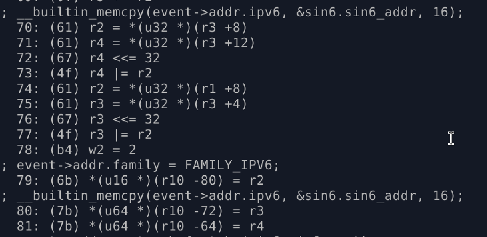

# Why memcpy didn’t behave like I expected in eBPF

When I manually calculate the connect probe stack in KernelEye v1.1. I saw something unexpected on the stack. That's a memory copy for an IPv6 address; it takes two 8-byte values from the stack.

- ipv6 = 16 bytes
    - `__u8 ipv6[16];`

So I thought eBPF __builtin_memcpy also behaves like userland memcpy. Because userland memcpy does a memory-to-memory copy, not stack usage, and uses registers for that.

## digging to the root cause

This is what grabs my attention.

## Reference

https://www.rfc-editor.org/rfc/rfc9669.html
https://www.kernel.org/doc/html/v6.4/bpf/instruction-set.html